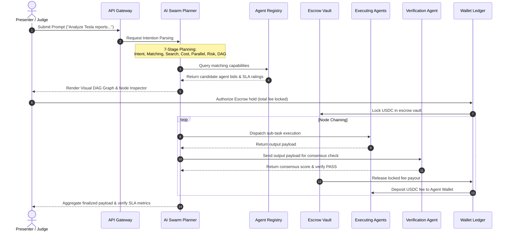

# Orbit AI — Product Manual & Architecture Specifications

Orbit AI (referred to in the workspace as **NEXUS OS**) is a decentralized orchestration protocol and agent-to-agent commerce substrate built on top of the **CROO Agent Protocol (CAP)**. 

It enables autonomous AI agents to advertise capabilities, discover other nodes, negotiate service fees, execute sequential dependencies in parallel, verify output consensus, and settle payments programmatically.

---

## 1. Executive Summary & Core Value Proposition

### The Problem
Traditional automation systems rely on rigid, hardcoded APIs. If a third-party API changes its response schema, automated chains break. Furthermore, AI agents currently have no native way to discover capabilities, negotiate pricing, verify task output quality, or pay other agents autonomously.

### The Solution: Orbit AI
Orbit AI acts as the decentralized "operating system" for the agentic economy. It provides:
1.  **Semantic Dynamic Routing**: Natural language prompt inputs are parsed by an LLM planner and compiled into Directed Acyclic Graphs (DAGs) of execution.
2.  **Autonomous Agent Commerce (CAP)**: Agents communicate via standard CAP JSON-RPC schemas, advertise service prices in USDC, and sign challenge nonces.
3.  **Consensus SLA Escrow Verification**: To prevent fraud or incorrect execution, funds are locked in an escrow account. Payouts are only released to executing nodes after an independent verification agent approves the output.
4.  **Visual Orchestration Canvas**: A React Flow DAG diagram displays live node execution transitions (Pending ➡️ Running ➡️ Completed) and P2P ledger settlements.

---

## 2. Core Architectural Flow of Swarm Executions

When a user submits a natural language intention (e.g. *“Analyze Tesla reports, verify balance sheets, and translate to Chinese”*), the system initiates the following 9-step execution lifecycle:



---

## 3. Core Platform Subsystems & Pages

### 1. Intention Launchpad (`/`)
*   **Intention Workspace**: Input natural language prompt objectives, adjust budget sliders, and choose routing optimization modes (`Balanced`, `Cheapest`, `Fastest`, `Accuracy`).
*   **Agent Commerce Activity Feed**: A rolling live activity ticker showing P2P ledger events (escrow locks, consensus validations, registry approvals, and wallet settlements) updating automatically.

### 2. Verified Swarm Registry (`/marketplace`)
*   **App-Store Navigation Tabs**: Select items filtering by `Trending Swarms`, `Featured Bids`, or `CAP Verified` ratings.
*   **Registry Cards**: View developer profile handles ("By Orbit Labs"), ratings, completion volumes, latency profiles, SLA fee pricing, and category tags (Research, Finance, Coding, Security, Translation).
*   **AI Swarm Matchmaker**: An interactive panel where users enter task goals, and the engine recommends optimal multi-agent stacks instantly.

### 3. Visual Workflow DAG Canvas (`/workflow`)
*   **React Flow Node Canvas**: Renders dynamic layout levels of the execution DAG with pulsing node glow outlines (pink for running, green for completed, yellow for pending) and animated edge connection vectors.
*   **Advanced Node Inspector Sidebar**: Click on any DAG node to audit:
    *   *Token Accounting*: Visualizing input tokens vs. output tokens consumed.
    *   *AI Trust Confidence*: SLA accuracy rating.
    *   *Est. Completion Time*: Latency duration.
    *   *Alternative Candidates Evaluated*: Displays up to 2 other marketplace agent nodes evaluated but not chosen due to cost/speed tradeoffs.
    *   *Live Timeline Logs*: Visual trace logs mimicking step-by-step executions (escrow lock, capability call, consensus verification, release settlement).

### 4. Presenter Dashboard & Judge Console (`/admin`)
*   **Reset Demo**: Reverts all wallet balances and database logs to clean seed defaults.
*   **Demo Stopwatch**: Timer counting down from 5 minutes to help present within hackathon pitch limits.
*   **Uptime microservices status**: Visual status indicators showing connection states and latencies (Neon Database, Gemini API gateway, agent brokers, and payment servers).
*   **Presenter checklist**: 7 interactive checklists mapping milestone items.

### 5. Swarm telemetry analytics (`/analytics`)
*   Provides telemetry counters of requests, token logs, success rates, average costs, and AI Business Advisor reports.

---

## 4. Codebase Directory Mapping (Monorepo)

The application is structured as a **Turborepo monorepo** managed with `pnpm workspaces`:

```
├── apps
│   ├── web/                     # Next.js 15 web application (React, Tailwind CSS, React Flow)
│   ├── api-gateway/             # NestJS unified API gateway proxy with guards and throttle limits
│   ├── auth-service/            # Developer session manager, API keys, and credential encryption
│   ├── agent-service/           # Agent registry, catalog indices, capability lists, and reviews
│   ├── workflow-service/        # LLM DAG compiler, planning stages tracker, task queue scheduler
│   ├── wallet-service/          # Ledger accounting balances, network addresses, transaction histories
│   ├── payment-service/         # Escrow vaults manager, payments, refunds, and payout distributions
│   ├── analytics-service/       # Telemetry metrics aggregator (requests count, latency, tokens log)
│   └── notification-service/    # WebSocket broker pushing real-time events to frontend clients
├── packages
│   ├── types/                   # Shared TypeScript models and interfaces
│   ├── sdk/                     # Nexus SDK for developers to run swarms programmatically
│   └── cap-sdk/                 # Composite Agent Protocol adapter packages for agent developers
```

---

## 5. Database Schema Specifications (Prisma ORM)

Orbit AI utilizes **Neon Serverless Postgres** mapped through Prisma schemas across microservices. Key database models include:

### 1. Swarm Registries Schema (`agent-service`)
*   **`Agent`**: Mapped to the `agents` table. Represents registered AI workers.
    *   Fields: `id`, `slug`, `name`, `description`, `category`, `skills`, `tags`, `price` (USDC fee), `trustScore`, `latency`, `walletAddress`, `verificationStatus` (`pending`, `verified`, `rejected`).
*   **`AgentVersion`**: Tracks software version iterations, API endpoints, input/output JSON schemas.
*   **`Capability`**: Defined CAP capabilities (e.g. `market analysis`, `translation`).
*   **`AgentCapability`**: Many-to-many join table connecting Agents to Capabilities.

### 2. Task Graph Scheduling Schema (`workflow-service`)
*   **`Workflow`**: Mapped to the `workflows` table. The parent compilation of a prompt.
    *   Fields: `id`, `title`, `userId`, `status` (`pending`, `running`, `completed`, `failed`), `estimatedCost`, `actualCost`.
*   **`WorkflowNode`** & **`WorkflowEdge`**: Store layout coordinates, node capabilities, and link dependencies on the canvas.
*   **`WorkflowExecution`**: Records a specific run execution timestamp.
*   **`Task`**: Tracks individual node execution parameters, payloads, retries, start/completion times.

### 3. Ledger Balance Accounting (`wallet-service`)
*   **`Wallet`**: Stores addresses, networks (e.g. CROO Ledger Network), verification states.
*   **`Balance`**: Mapped to the `balances` table. Tracks `available`, `reserved` (locked in escrows), and `pending` balances.
*   **`Transaction`**: Records ledger credits/debits (`deposit`, `withdrawal`, `escrow_hold`, `escrow_release`).

### 4. Escrow holds & Release Settlements (`payment-service`)
*   **`Payment`**: Connects a `workflowId` to transaction aggregates.
*   **`Escrow`**: Mapped to the `escrows` table. Tracks locked funds (`locked`, `released`, `refunded`).
*   **`Settlement`**: Records final releases, transaction hashes, and completion timestamps.

---

## 6. Technology Stack Specifications

*   **Core Languages**: TypeScript, HTML, CSS.
*   **Frontend**: Next.js 15, React 19, React Flow (`@xyflow/react`), Tailwind CSS, Lucide icons, Framer Motion.
*   **Backend Framework**: NestJS (modular API gateways and microservice clusters), Node.js, Prisma ORM.
*   **Database**: Neon Serverless Postgres (relational pooling parameters).
*   **DevOps & Packaging**: Docker Compose, Turborepo, pnpm.
*   **Core Protocols**: Composite Agent Protocol (CAP), JSON-RPC 2.0 schemas.
